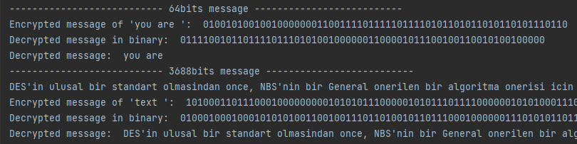

# DES-Algorithm
Data encryption standard (DES) algorithm implementation in Python.

* DES (Data Encryption Standard) is a block cipher that encrypts in blocks of 64 bits. For a 64-bit input block, a 64-bit output block is obtained.
* DES is a symmetric algorithm. That means the same key is used for encryption and decryption.
* The algorithm is a combination of two techniques. These are referred to as confusion and diffusion. The application of a simple combination of these techniques on a block is called a round. DES has 16 loops.
* More precisely, these two techniques are applied 16 times on a block of plain text.

## Structure of DES Algorithm 

<p float="left">
  
  
</p>

## Usage 

``` python
 print("--------------------------- 64bits message --------------------------")
 text = "you are "  # 64bits text
 binary_text = get_binary_message(text)
 cipher = des_encrypt.encrypt(binary_text)
 
 print("Encrypted message of 'you are ': ", cipher)
 decrypted_cipher = des_decrypt.encrypt(cipher)

 print("Decrypted message in binary: ", decrypted_cipher)
 print("Decrypted message: ", get_ascii_message(decrypted_cipher))

 print("--------------------------- 3688bits message --------------------------")
 text2 = ""
  with open("text.txt", "r") as t:
     text2 = t.read()
     
 print(text2)
 binary_text = get_binary_message(text2)
 cipher = des_encrypt.text_encrypt(binary_text)
 
 print("Encrypted message of 'text ': ", cipher)
 decrypted_cipher = des_decrypt.text_encrypt(cipher)
 
 print("Decrypted message in binary: ", decrypted_cipher)
 print("Decrypted message: ", get_ascii_message(decrypted_cipher))

```
* Output of the code above



